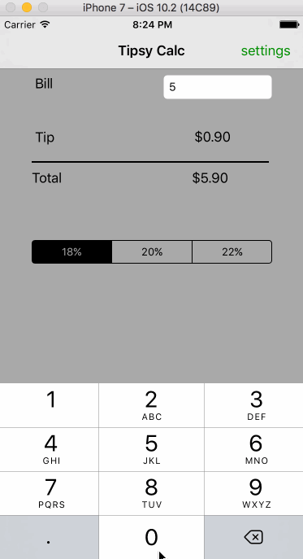
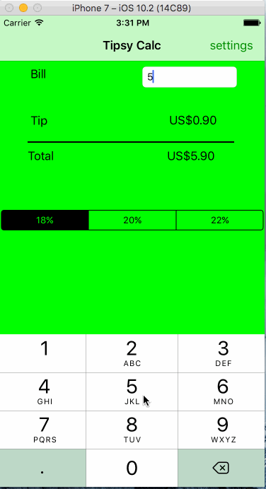

# Tipsy Calculator

Demo of tip calculator for CodePath Bootcamp.

Time spent: 24 hours

Features Implemented:

  <b>Required</b>: 
  
  1)User can enter a bill amount and tip and total values are updated dynamically 
  2)User can select from tip percentages 
  3)create settings page
  
  <b>Optional</b>: 
  
  1)Background colors for settings view 
  2)Make sure the keyboard is always visible and the bill amount is always the first responder 
  3)Remember the bill amount across app restarts. After an extended period of time, clear the state
   
                

References:

1)https://www.youtube.com/watch?v=lyR8w6zmxVc 
2)https://github.com/nathanshayefar/CodePath-iOS-Project-0-Tip-Calculator 
3)https://developer.apple.com/library/content/documentation/Swift/Conceptual/Swift_Programming_Language/

